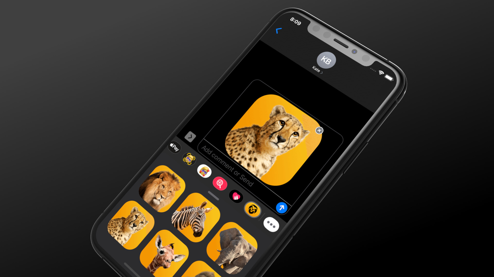

# Africa app

## Main objectives of this iOS SwiftUI project

### **TOPICS ARE COVERED**:

- **JSON with Swift** (basic and advanced approach),

- **Grid Layouts** (basic and advanced approach with a cool feature),

- **MapKit Integration** (basic and advanced approach with another cool feature),

- **Video Player**,

- **Launch Screen**,

- Swift programming concept: **Extension**,

- Swift programming concept: **Generics**,

- **Prototype** the whole application with SwiftUI 2 framework,

- Design and **improve the User Experience**,

- **iMessage Sticker Pack**,

Bring the full iPadOS app to **macOS 11 Big Sur using Mac Catalyst technology**,

- Learn what is **Pseudocode** and why it is important,

- What is a **Bundle** and **Extension** in app development and how to use them, etc.

Professional iOS 14 app icon on the home screen

Complex layout system with 1 list and 3 grid views on the toolbar (new iOS feature)

Tab menu showing the additional features that we're going to cover

Bring the fully-featured iPadOS app to macOS with Mac Catalyst framework with an ease

Full-fledged iPadOS app with sidebar navigation on the top

MapKit integration, SwiftUI 2 Grid layout and traditional list view with navigation link

iMessage Extension: Sticker Pack

A new way to create Launch Screen in iOS 14 app development
